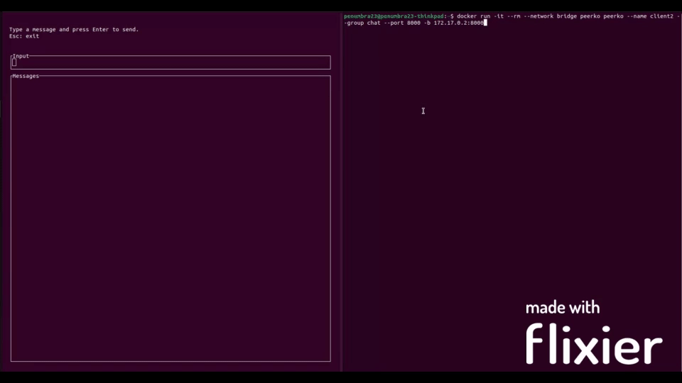

# peerko

NAT Traversal hole punching P2P chat application

## Introduction

**peerko** is a P2P chat application utilizing a popular NAT traversal technique called hole punching. Control and chat messages are transported using a custom protocol over UDP.

**peerko** runs in two modes:
1. server - runs a rendezvous server for peer discovery
2. client - known as chat, runs a client with a terminal UI that enables exchanging messages with other peers

## Usage

To run the P2P chat, some conditions need to be fulfilled:
- **ONE** server with a public IP address should be running in server mode (`-s true`); messages are not relayed through this server, it only acts as a rendezvous server to exchange public interfaces over peers
- NAT types in front of the chat peers should be [endpoint independent](https://www.ietf.org/rfc/rfc5128.txt)

Chat peers don't need to have a static IP address.

### Commands

When running the chat client, besides sending messages there are additional helper commands:
- `peers` - list connected peers
- `req` - send a `MemberRequest` to connected peers to discover additional peers

## Contribution

If you want to contribute to this project, there are some additional features to be made:

- automatic peer discovery (periodically send `MemberRequest`)
- encryption

## License
MIT